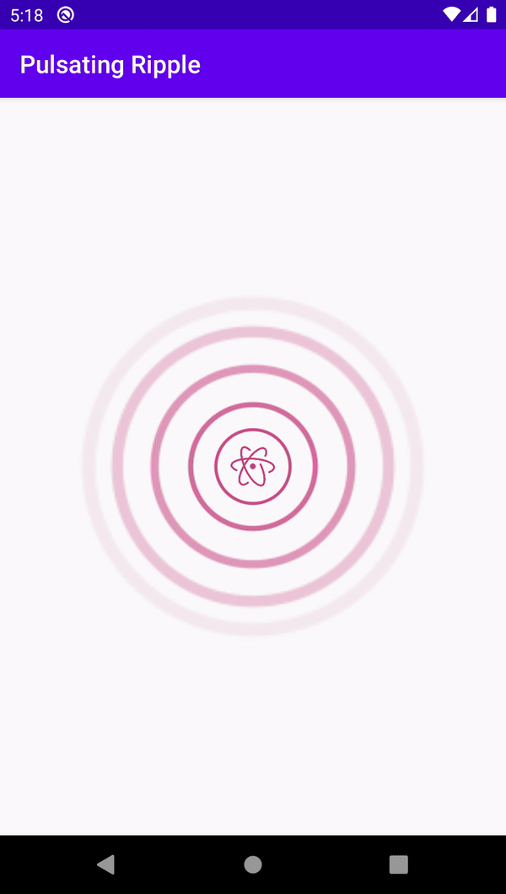

# Pulsating Ripple
[](https://jitpack.io/#invissvenska/Pulsating-Ripple) 
[](https://android-arsenal.com/api?level=16)
<a href="https://github.com/invissvenska/Pulsating-Ripple/actions"></a> 
<span class="badge-buymeacoffee"><a href="https://www.paypal.com/paypalme/svenvandentweel/3" title="Donate to this project using Buy Me A Coffee"></a></span>  

## Prerequisites

Add this in your root `build.gradle` file (**not** your module `build.gradle` file):

```gradle
allprojects {
    repositories {
        ...
        maven { url "https://jitpack.io" }
    }
}
```

## Dependency

Add this to your module's `build.gradle` file (make sure the version matches the JitPack badge above):

```gradle
dependencies {
    ...
    implementation 'com.github.invissvenska:Pulsating-Ripple:VERSION'
}
```

## Configuration

Add the `PulsatingLayout` to your layout and insert a View in it:

```xml
<nl.invissvenska.pulsatingripple.PulsatingLayout
    android:id="@+id/ripple"
    android:layout_width="match_parent"
    android:layout_height="match_parent"
    app:pr_duration="3000" // Time in ms for one animation cycle. Optional, default is 3000
    app:pr_rippleAmount="10" // Amount of ripples in the animation cycle. Optional, default is 6
    app:pr_radius="64dp" // Start radius of the ripple. Optional, default is 24dp
    app:pr_scale="3" // Scale increment of the radius. Optional, default is 6
    app:pr_color="#000000" // optional
    app:pr_type="strokeRipple" // Stroke (strokeRipple) or filled (fillRipple) ripples, Optional, default is 'fillRipple'
    app:pr_strokeWidth="4dp" // Width of stroke when using 'type=stroke' otherwise field is ignored. Optional, default is 2dp
>

    <ImageView
        android:id="@+id/centerImage"
        android:layout_width="36dp"
        android:layout_height="36dp"
        android:layout_centerInParent="true"
        android:src="@drawable/atom_icon"/>

</nl.invissvenska.pulsatingripple.PulsatingLayout>
```

## Usage

Start animation:

``` java
pulsatingLayout.startAnimation();
```
Stop animation:

``` java             
pulsatingLayout.stopAnimation();
```

## Screenshots

Stroke Ripple                             | Fill Ripple
:----------------------------------------:|:---------------------------------------:
 | 