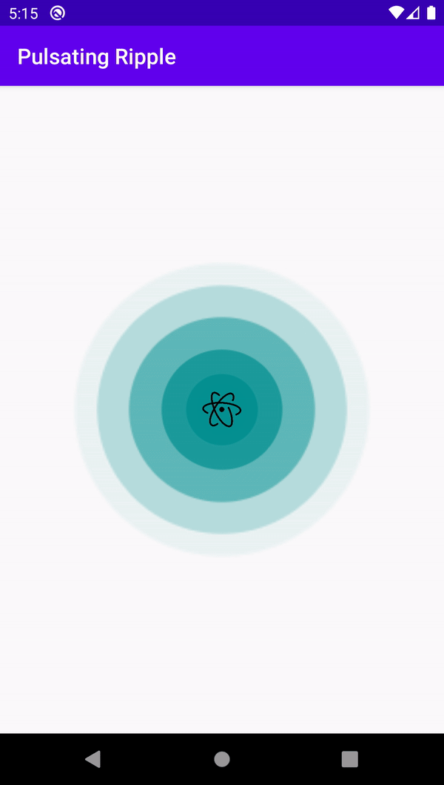

# Pulsating Ripple
[](https://android-arsenal.com/api?level=16)
[](https://jitpack.io/#invissvenska/Pulsating-Ripple) 
<a href="https://github.com/invissvenska/Pulsating-Ripple/actions"></a> 
<span class="badge-buymeacoffee"><a href="https://www.paypal.com/paypalme/svenvandentweel/3" title="Donate to this project using Buy Me A Coffee"></a></span>  

## Screenshots

**Please click the image below to enlarge.**

Stroke Ripple                             | Fill Ripple
:----------------------------------------:|:---------------------------------------:
 | 

## Prerequisites

Add this in your root `build.gradle` file (**not** your module `build.gradle` file):

```gradle
allprojects {
    repositories {
        ...
        maven { url "https://jitpack.io" }
    }
}
```

## Dependency

Add this to your module's `build.gradle` file (make sure the version matches the JitPack badge above):

```gradle
dependencies {
    ...
    implementation 'com.github.invissvenska:Pulsating-Ripple:VERSION'
}
```

## Configuration

Add the `PulsatingLayout` to your layout and insert a View in it:

```xml
<nl.invissvenska.pulsatingripple.PulsatingLayout
    android:id="@+id/ripple"
    android:layout_width="match_parent"
    android:layout_height="match_parent"
>

    <ImageView
        android:id="@+id/centerImage"
        android:layout_width="36dp"
        android:layout_height="36dp"
        android:layout_centerInParent="true"
        android:src="@drawable/atom_icon"/>

</nl.invissvenska.pulsatingripple.PulsatingLayout>
```

## Usage

Start animation:

``` java
pulsatingLayout.startAnimation();
```
Stop animation:

``` java             
pulsatingLayout.stopAnimation();
```

## PulsatingLayout Attributes
Attributes | Type | Default | Mandatory | Description
--- | --- | --- | --- | ---
pr_duration | Integer | 3000 | No | Time in milliseconds for one animation cycle.
pr_rippleAmount | Integer | 6 | No | Amount of ripples in the animation cycle.
pr_radius | Dimension | 24dp | No | Start radius of the ripple.
pr_scale | Float | 6 | No | Scale increment of the ripple.
pr_color | Color | #039191 | No | Color of the ripple.
pr_type | Integer (strokeRipple, fillRipple) | fillRipple | No | Makes the ripples stroke or filled.
pr_strokeWidth | Dimension | 2dp if (pr_type == strokeRipple) | No | Width of the stroke, will only be used when pr_type == strokeRipple.
